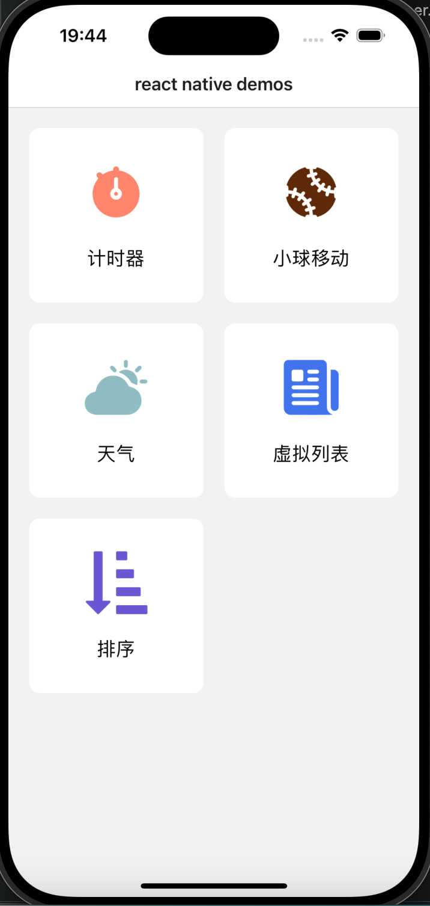

# React Native fengpu

## 使用
* 路由：
  * reactive-nagative
* 动画：
  * react-native-reanimated
* 列表：
  * RecyclerListView 高性能列表，手写实现虚拟列表，包括上拉刷新，下拉加载
* 手势：
  * react-native-gesture-handler 
* 滚动
  * react-native-swiper

## 计时器
### 展示

### 总结
* 功能：
	* 计时器可以启动、停止、记录时间段和重置。
	* 显示总时间和最近一次记录的时间段。
	* 保持记录列表，展示历史记录。
## 移动卡片
### 展示

### 总结
* 功能
	* 拖拽功能：使用PanResponder来处理拖拽动作。用户可以拖拽界面上的元素到不同位置，代码逻辑会处理元素位置的更新。
	* 布局动画：使用LayoutAnimation进行布局变化时的动画处理，使元素位置的变化看起来更流畅。
	* 元素层次的动态管理：通过将拖拽的元素移到数组的最后来保证该元素在视图上的最上层。
## 虚拟列表
### 展示

### 总结
使用了 RecyclerListView 来创建一个具有高性能滚动特性的列表。该列表结合了动态加载数据和下拉刷新的功能，使用了一系列现代化的Hooks和动画库来增强用户体验。
通过这个实践，深入了RN事件的响应者模型。对于动画的理解也更深刻。
* 功能
	* 动态数据加载：通过维护一个状态数组list和分页计数pageNum来实现动态数据加载。数据是按页递增加载的，到达底部时触发更多数据的加载。
	* 下拉刷新和加载更多：整合RecyclerListView的下拉刷新功能和底部加载更多的逻辑，refresh状态控制是否显示下拉刷新动画。
	* 自定义滚动动画：使用useSharedValue和useAnimatedStyle来创建下拉刷新的动画效果，增强视觉体验。
	* 手势处理和触摸反馈：通过GestureHandlerRootView和GestureDetector处理复杂的触摸事件，包括滚动和手势拖动。
## 天气
### 展示

### 总结
* 功能
  * 显示天气，使用native-swiper组件，实现切换功能
## 拖动小球
### 展示

### 总结
* 功能
  * 组件实现了一个可拖动的图标，图标在按下时背景色变为粉色，松开后背景色变回白色。用户可以通过拖拽来移动图标在屏幕上的位置。

